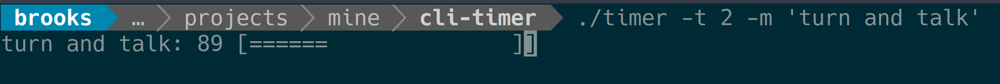

# CLI Timer
> This is a timer that will count down in seconds while showing how much time is left visually

This is the source code for a command line timer that will count down to zero. As a bonus it will also display the amount of time left in seconds. the amount of time (in minutes) and the message displayed are provided by options.



## Installation

OS X & Linux:

Copy the binary into a folder in your PATH directory (for example ~bin)

```sh
cp bin/timer ~/bin/
```

## Usage example

Timer takes the following options

* -t (number) The amount of time to count down in minutes. Required
* -m (string) A message to display next to the timer. Required
* -h Display help

timer -t 5 -m 'turn and talk'

## Development setup

Fork and clone this repo. The source is all in `timer.c`. Make your changes and then run `make` to compile and test.

## Release History

1.0.0 Initial version created

## Meta

Brooks Patton – [@Brooks_Patton](https://twitter.com/Brooks_Patton)

Distributed under the MIT license. See ``LICENSE`` for more information.

[https://github.com/BrooksPatton/cli-timer](https://github.com/BrooksPatton/cli-timer)

## Contributing

1. Fork it (<https://github.com/BrooksPatton/cli-timer/fork>)
2. Create your feature branch (`git checkout -b feature/fooBar`)
3. Commit your changes (`git commit -am 'Add some fooBar'`)
4. Push to the branch (`git push origin feature/fooBar`)
5. Create a new Pull Request
